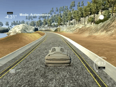

# Reflection of PID Project

## Describe the effect each of the P, I, D components had in your implementation.

The proportional component "P" changes the car's steering depending on how far the car deviates from the center lane as given by the CTE. Its effect is very visible when the other two components are set to 0. The car always steers back to the center, but due to the problem of oscillation the car makes progressively sharper turns, eventually leading to the car leaving the track. It's an essential component of PID, but on its own, it cannot control the car smoothly around the track.

*Car control with P component only:*  

The differential component "D" takes the change of CTE into account making it possible to counter the oscillation effect because high changes in CTE values are counteracted by the "D" component. This results in the car not overshooting the center lane, thus, staying in the center. When both the "P" and "D" components are used, the car can safely navigate around the track.

*Car control with P and D components only:*  

Finally, the integral component "I" is used to eliminate biases, e.g., when a car is not driving entirely straight without steering. In this particular simulator task, using the "I" component does not make a big difference. Turns seem to be taken a little bit more smoothly.

*Car control with PID:*  

## Describe how the final hyperparameters were chosen.

Hyperparameters were tweaked manually, but using the intuition of Twiddle. First, several values for the "P" component were tried out, without finding a single value that can move the car around the track because of the oscillation effect. When the "D" component was added, the values were changed in succession until an improvement could be observed. From there the parameters were changed by small steps at a time until the car could successfully drive around the track. The "I" component was added last. A relatively small value of "I" seems to make a small improvement to the car's movements. Once it gets too big, however, the car's driving smoothness visibly gets worse. 

**The final hyperparameters:**  
P component: 0.25   
I component: 0.0005   
D component: 5
